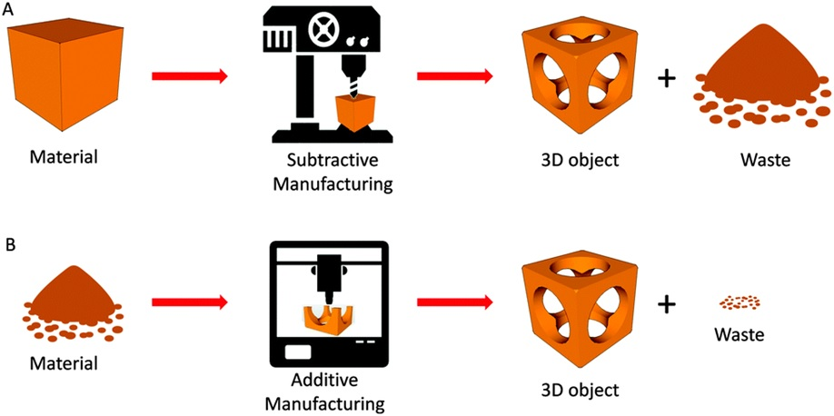
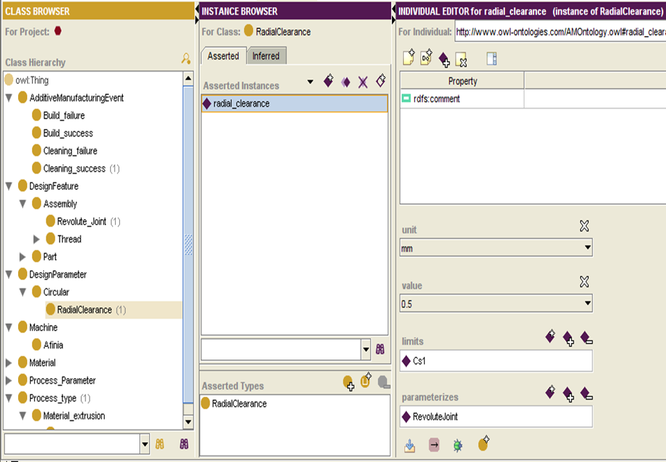
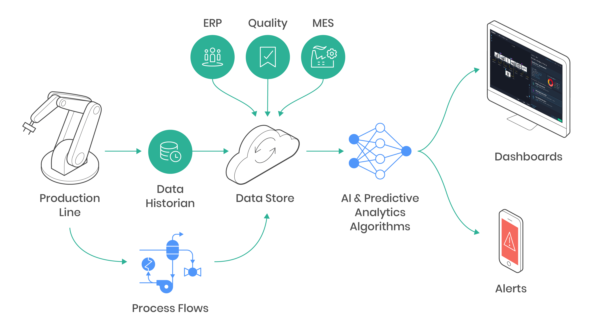

#### Predictive ML models for Rapid Prototyping (3D Printing / Additive Manufacturing)

* Developed a prediction system for prototyping complex geometries and evaluating tool parameters. 
* The engineered model can store experimental knowledge and predictions from CAD model and tested as a guidance system for Julia 3D printer with successful builds of lag, cap screws.
* Developed predictive models with (Decision Tree-based ensemble methods) Random Forest to assess rapid prototyping models, tabulating build quality and tool wear for machine components.
* Cross-validated the prediction results with SVM, and with parameters of synthesized tools, before deployment at the Design lab.
* **Keywords** (Semantics, Rapid Prototyping, CAD, Java/Protégé, Predictive Models)

 

---

> Abstract 
Creating complex geometries that are difficult to produce with subtractive manufacturing, and consolidating multiple parts or fabricating parts together in an assembled state to reduce manufacturing time and cost are two examples of the freedoms that additive manufacturing (AM) offers. Seizing these benefits cannot be achieved unless designers shift their thinking from traditional design for subtractive manufacturing. 

There is a need of formal and structured guidelines on benefits and limitations of AM, as well as how designs to accommodate those benefits. The engineered DFAM ontology is capable of storing domain and experiential knowledge, retrievable for guiding designers in a tutoring system and as a basis of a CAD tool. 

Link: [Julia 3PV & Fractal Volterra printers](https://fracktal.in/products-3dprinters.html)
