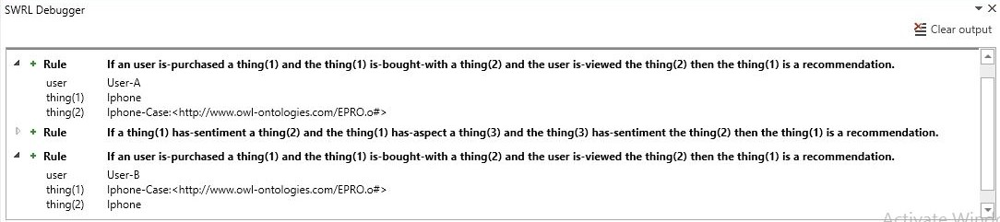
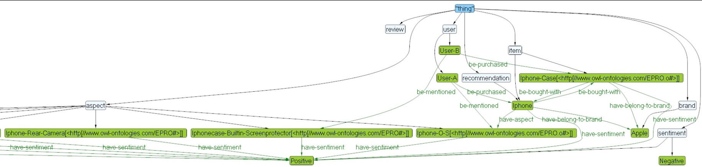
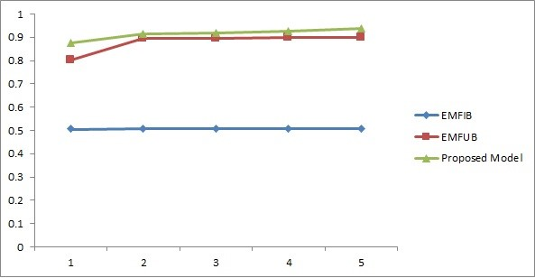

##### Explainable-product-recommendations-with-Semantic-web-rules

* Developed a product recommendation system using Semantic Web rules.
* Associates statistical recommendations along with explanation, to make the customer aware of **"why" the recommendation**.

 

* Results:

Mean explainable precision

Mean explainable recall

> Data: http://jmcauley.ucsd.edu/data/amazon/ (Amazon product category reviews). 
> > Tools/ Platform: Protege, Java VM

